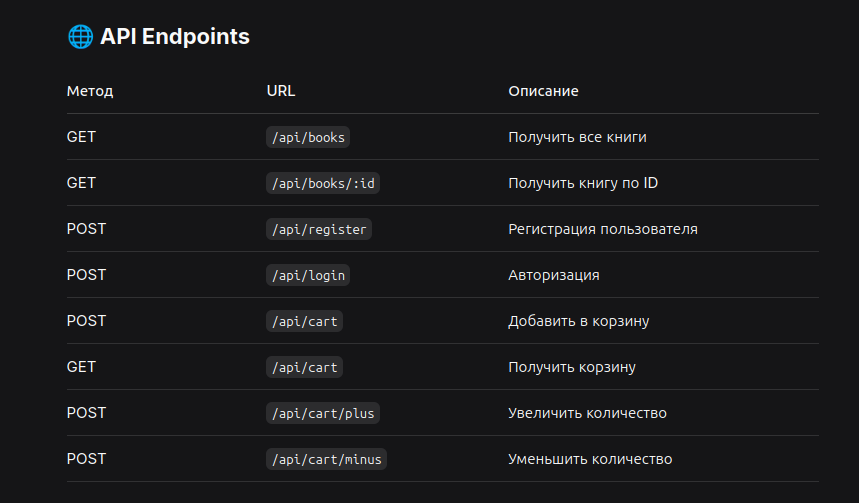

### Book Market — учебный fullstack-проект интернет-магазина книг, разработанный с использованием React, Node.js и PostgreSQL.

## 🎯 Функционал
- **Аутентификация**: Регистрация и вход с JWT токенами
- **Каталог книг**: Просмотр всех книг с возможностью фильтрации
- **Корзина**: Добавление/удаление товаров, управление количеством
- **Адаптивный дизайн**: Работает на мобильных, планшетах и десктопах
- **Защищённые маршруты**: Доступ к корзине только для авторизованных пользователей

## 🛠 Технологический стек

### Frontend
- **React 18** + Vite - быстрая сборка
- **Tailwind CSS** - современные стили
- **React Router** - навигация
- **Axios** - HTTP-запросы
- **Context API** - управление состоянием

### Backend
- **Express.js** - REST API сервер
- **PostgreSQL** - реляционная база данных
- **JWT** - аутентификация
- **bcrypt** - хеширование паролей
- **CORS** - безопасность межсайтовых запросов

## Установка

### 1. Клонирование репозитория
```bash
git clone https://github.com/ваш_username/book-market.git
cd book-market

2. Настройка базы данных
bash

# Подключись к PostgreSQL
sudo -u postgres psql

# Создай базу данных и пользователя
CREATE DATABASE bookshop;
CREATE USER bookuser WITH PASSWORD 'password';
GRANT ALL PRIVILEGES ON DATABASE bookshop TO bookuser;

# Выйти из psql
\q

3. Запуск Backend
bash

cd server
npm install
cp .env.example .env  # настрой переменные окружения
node app.js

4. Запуск Frontend
bash

cd client
npm install
npm run dev




## 🗄️ Структура базы данных

### Таблица users
```sql
CREATE TABLE users (
  id SERIAL PRIMARY KEY,
  email TEXT UNIQUE NOT NULL,
  password TEXT NOT NULL,
  created_at TIMESTAMP DEFAULT CURRENT_TIMESTAMP
);
```

### Таблица books
```sql
CREATE TABLE books (
  id SERIAL PRIMARY KEY,
  title TEXT NOT NULL,
  author TEXT NOT NULL,
  price NUMERIC(10,2) NOT NULL,
  image TEXT,
  created_at TIMESTAMP DEFAULT CURRENT_TIMESTAMP
);
```

### Таблица cart
```sql
CREATE TABLE cart (
  id SERIAL PRIMARY KEY,
  user_id INTEGER REFERENCES users(id) ON DELETE CASCADE,
  book_id INTEGER REFERENCES books(id) ON DELETE CASCADE,
  quantity INTEGER DEFAULT 1
);
```

### Таблица orders
```sql
CREATE TABLE orders (
  id SERIAL PRIMARY KEY,
  user_id INTEGER REFERENCES users(id) ON DELETE CASCADE,
  total_price NUMERIC(10,2) NOT NULL,
  status TEXT DEFAULT 'pending',
  created_at TIMESTAMP DEFAULT CURRENT_TIMESTAMP
);
```

### Таблица order_items
```sql
CREATE TABLE order_items (
  id SERIAL PRIMARY KEY,
  order_id INTEGER REFERENCES orders(id) ON DELETE CASCADE,
  book_id INTEGER REFERENCES books(id),
  quantity INTEGER NOT NULL,
  price NUMERIC(10,2) NOT NULL
);
```
